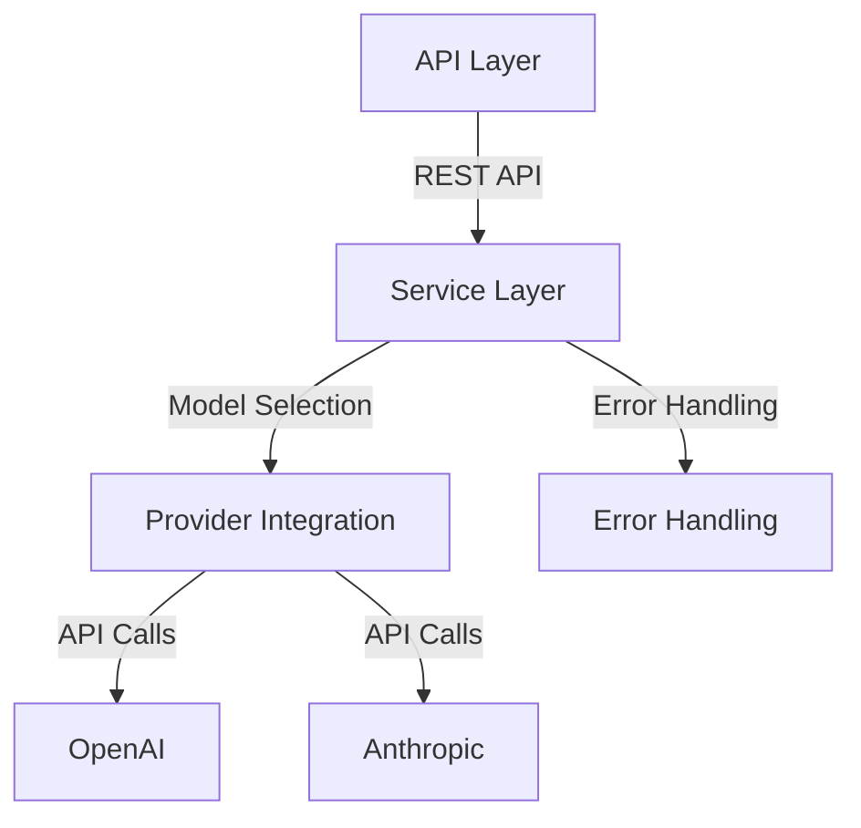

# Container View

## Main Components

1. API Layer
   - NestJS REST API
   - Rate limiting (10 req/min)
   - API Key authentication
   - Request validation
2. Service Layer
   - Model selection logic
   - Provider fallback handling
   - Response processing
   - Error handling
3. Provider Integration
   - OpenAI client
   - Anthropic client
   - Configurable model settings
4. Observability
   - Langfuse integration
   - Prompt management
   - Performance tracking

## Container Diagram

